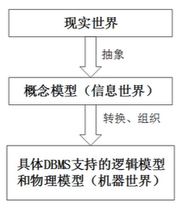
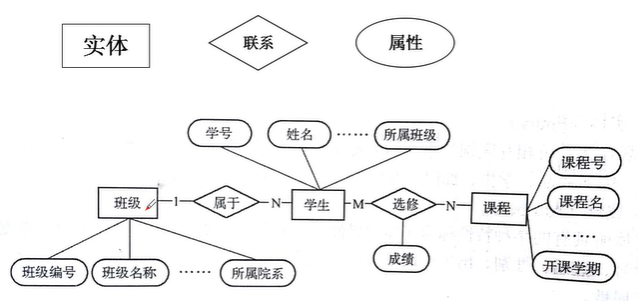

#### 数据库系统的特点：（五方面）

1. 数据结构化
2. 数据冗余度小
3. 数据共享性好
4. 数据独立性高
5. 数据库保护

#### 第一节：数据库基本概念

##### 常用的四个基本概念：

###### 数据

数据（Data）是**描述事物的符号记录**，是直指用物理符号记录下来的、可以鉴别的信息

包括数字、字母、文字、特殊字符组成的文本数据，也可以是图形、图像、动画、影响、声音、语言等多媒体数据。

###### 数据库

数据库（`Database,DB`）是长期存储在计算机中的有组织的、可共享的数据集合。

数据库中存储的数据具**有永久存储**、**有组织**和**可共享**三个的基本特点。

###### 数据库管理系统

数据库管理系统（`Database Management Stsyem，DBMS`），是专门用于建立和管理数据库的一套软件，介于**应用程序和操作系统**之间

1. 数据定义
    1. 提供数据定义语言（DDL），定义表、视图、存储过程、触发器等
2. 数据操纵
    1. 提供数据操纵语言（DML）操纵数据库中的基本数据，包括查询、插入、删除和修改等。
3. 数据库的运行管理
    1. 保证数据库的安全性、完整性、多用户数据的并发使用以及发生故障后的系统恢复。
4. 数据库的建立与维护
    1. 创建数据库、对数据库的空间维护、数据库的备份与恢复、数据库的重组织和性能监听、分析等。
5. 数据组织、存储和管理
    1. 例如：索引查找、顺序查找等
6. 其他功能
    1. 主要包括与其他软件的网络通信功能、不同数据库管理系统之间的数据传输以及相互访问功能等。 

###### 数据库系统

数据库系统是指在计算机中引入数据库技术之后的系统。通常，一个完整的数据库系统包括**数据库、数据库管理系统**及**相关使用工具、应用程序、数据库管理员和用户**

#### 第二节：数据管理技术的发展

##### 一、人工管理阶段

特点：

1. 数据不保存
2. 应用程序管理数据
3. 数据面向应用

**注意：记录内无结构，整体无结构**

##### 二、文件系统阶段

特点：

1. 数据的管理者：文件系统，数据可长期保存
2. 数据面向的对象：某一应用程序
3. 数据的共享程序：共享性差、冗余度大
4. 数据的结构化：记录内有结构，整体无结构
5. 数据的独立性：独立性差，数据的逻辑结构改变必须修改应用程序
6. 数据控制能力：应用程序自己控制

##### 三、数据库系统阶段

特点：

1. 数据集成
2. 数据共享度高
3. 数据冗余度小
4. 数据一致性
5. 数据独立性高
6. 实施统一管理与控制
7. 减少应用程序开发与维护的工作量

#### 第三节：数据库系统的三级模式结构

##### 一、数据库系统的三级模式结构

###### 1.模式

模式也称为**概念模式或逻辑模式**，它是数据库中全体数据的逻辑结构或特征的描述，是所有用户的公共数据视图。

一个数据库只有一个模式，并且相对稳定。

###### 2.外模式

外模式也称**子模式或用户模式**，它是数据库用户（包括应用程序员和最终用户）能够看见和使用的局部数据的逻辑结构和特征的描述，是某一应用有关的数据的逻辑表示。

**DBMS**提供子模式描述语言（Subschema DLL）来严格定义子模式。

###### 3.内模式

内模式也称为**存储模式**（Storage Schema），是对数据路中数据的**物理结构和存储方式**的描述，是数据在数据库内部的表示形式。

###### 4.三级模式结构的两层映像与数据独立性

1. 外模式/模式映像（逻辑独立性）
2. 模式/内模式映像（物理独立性）

##### 二、数据库系统的运行与应用结构

###### 1.客户/服务器（Client/Server,C/S）模式

1. 例如：QQ、桌面客户端游戏

###### 2.浏览器/服务器（）

1. 例如：网站、在线WEB游戏

#### 第四节：数据模型

##### 第一节：数据特征与数据模型的组成要素

对现实世界数据特征进行抽象的数据模型，需要描述数据的静态特征和动态行为。

###### 一、数据特征与数据模型组成要素

1. 数据结构
    - 描述系统的**静态特征**，即数据对象的数据类型、内容、属性及数据对象之间的联系。
2. 数据操作
    - 描述系统的动态操作，是对各种对象实例允许执行的操作集合，包括操作及有关的操作规则。
3. 数据约束
    - 描述数据结构中数据间的**语法和语义关联**，包括相互制约与依存关系及数据动态变化惠泽，以保证数据的正确性，有效性和相容性。

###### 二、数据模型的分类

1. 概念层数据模型

    1. 信息世界中的基本概念

        1. 实体
            - 客观存在并可相互区别的事物称为实体。如：学生、部门、课程等。
        2. 属性
            - 实体所具有的特征。如学生具有学号、姓名、性别等特性。
        3. 码或键
            - 可唯一标识实体的**属性集**。如学号是学生实体的码或键
        4. 域
            - 属性的取值范围。如性别的域为(男、女)
        5. 实体型
            - 用实体名与属性名的集合标识同类实体，称为**实体型**
            - 如：学生（学号、姓名、性别、出生日期）
        6. 实体集
            - 同型实体的集合称为实体集。
            - 如：每个学生时一个实体，所有的学生构成一个实体集
        7. 联系
            - 实体（型）内部之间的联系和实体（型）之间的联系
            - 一对一   1：1
            - 一对多   1：N
            - 多对多   M：N

        

        

    2. 概念模型的标识方法

        1. 概念模型：用来描述现实世界的事物，与具体的计算机系统无关，最典型的概念模型是实体联系`（E-R）`

    

2. 逻辑层数据模型

    1. 层次模型
    2. 网状模型
    3. 关系模型
    4. 面向对象模型

3. 物理层数据模型

    ​		也称为数据的物理模型（Physical Model），描述数据在存储介质上的组织结构，是逻辑模型的物理实现，即每一种逻辑模型在实现时都要有与其相对性的物理模型。

    ​		物理模型是数据库最底层的抽象，它确定数据的物理存储结构、数据存取路径以及调整、优化数据库的性能。

    ​		物理模型的设计目标是提高数据库性能和有效利用存储空间。

    ​		物理数据结构一般都向用户屏蔽，用户不必了解其细节。

    

#### 课后题：

