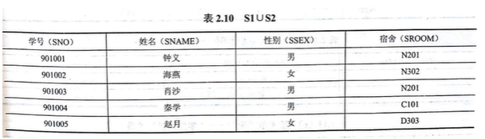
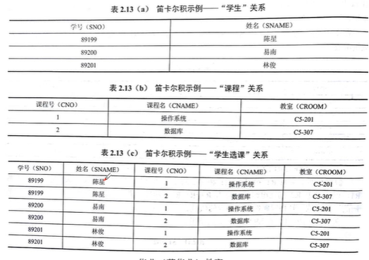

#### 第一节：关系数据库概述

##### 关系数据库应用数学方法来处理数据库中的数据

80年代，关系型数据库系统成为最重要、最流行的数据库系统

1. 典型的实验系统
    - System R 、University INGRES
2. 典型商用系统
    - Oracle、Sybase、Informix、IBM DB2、MS SQL Server
3. PC端小型数据库
    - Foxpro、Access、MySQL

#### 第二节：关系数据模型

##### 一、关系数据结构

关系模型的数据机构非常简单，只包含单一的数据结构，即关系。用户看来，关系模型是二维表格。

关系数据库的基本术语：

1. 表（`Table`）

    - 表，也称**关系**，是一个二维的数据结构，由表名、列、行数据构成。
    - 每个表的表明唯一，每一行描述一条具体的记录值。

2. 关系（`Relation`）

    - 同表。关系有三种类型：**基本关系、查询表和视图表**

3. 列（`Column`）

    - 表中的列，也称作**字段**（`Field`）或**属性**（`Attribute`），每一列有一个名称，称为列名、字段或属性名。

4. 属性（`Attribute`）

    - 同列。

5. 行（`Row`）

    - 也称**元祖**（`Tuple`）或**记录**（`Record`），一行数据即一个元祖或一条记录。
    - 

6. 元组（`Tuple`）

    - 同行

7. 分量（`Component`）

    - 元祖中的一个属性值称为分量。

8. 码或键（`key`）

    - 用来唯一标识一行数据的属性或属性组，比如学号、身份证号码等

9. 超码或超键（`Super Key`）

    - 如果一个关系中一个码移去某个属性，它任然是这个关系的码，则这样的码或键为该关系的超码或超键。
    - 比如（学号，姓名）、（学号，姓名，性别）、（学号，姓名，性别，出生日期）等

10. 候选码或候选键（`Candidate Key`）

    - 如果在关系的一个码或键中，不能移去任何一个属性，否则他就不是这个关系的码或键。如（学号，课程号）（身份证号，课程号）

11. 主码或主键（`Primary Key`）

    - 指定**一个**候选码来唯一标识一行数据

12. 全码或全键（`All-Key`）

    - 一个关系中所有属性都是主码或主键

13. 主属性（`Primary Attribute`）和非主属性（`NonPrimary Attribute`）

    - 包含任何一个候选码的属性称为主属性，不包含任何一个候选码的属性称为非主属性

14. 外码或外键（`Foreign Key`）

    - 某个属性不是这个关系的主码或候选码，而是另一个关系的主码，则该属性是外码。
    - 如：学生（学生，姓名，性别，出生日期，班主任，教师工号）
    - 教师（工号，姓名，性别，出生日期）

15. 参照关系和被参照关系

    - 以外码作为主码的关系成为被参照关系
    - 外码所在的关系称谓参照关系

16. 域（`Domain`）

    - 表示属性的取值范围，如：“性别”（男，女）

17. 数据类型

    - 表示属性的数据类型，如“**性别**”为字符型，“**工资**”为货币型

18. 关系模式

    - 关系模式是静态的，关系是动态的
    - 关系是关系模式在某一时刻的状态或内容

19. 关系数据库

    1. 关系数据库是以关系模型作为数据的逻辑模型，并采用关系作为数据组织的一类数据库，其数据操作建立在关系代数的基础上。

    2. **不是任意一个二维表都是关系，关系有下列要求**

        1. 每个属性都是不可分解的
        2. 每一个关系模式中属性的数据类型以及属性的个数是相对固定的
        3. 每一个关系模式的属性必须命名，且不同
        4. 同一关系中不允许出现候选码相同的两行
        5. 行可任意交换
        6. 列可任意交换

        

##### 二、关系操作集合

###### 1.基本的关系操作

1. **查询类**：选择、投影、连接、除、并、差、交、笛卡尔乘积等
2. **数据更新类**：插入、删除、修改

查询的表达能力很强，是其中最主要的部分

1. 关系操作的特点：
    - 集合操作方式，即操作的对象和结果都是集合。

###### 2.关系数据语言的分类

关系操作分为**代数方式**和**逻辑方式**

**代数方式**主要是**关系代数**，通过对关系的操作来表达查询要求的方式

**逻辑方式**主要是**关系验算**，使用谓词来表达查询要求的方式

具有关系代数和关系演算双重特点的语言：**SQL**（Structured Query Language，结构化查询语言）

###### 3.关系代数

**A：传统的集合运算**

并、差、交、笛卡尔积

1. 并

    

2. 差

    

3. 交

    

4. 笛卡尔积

    

